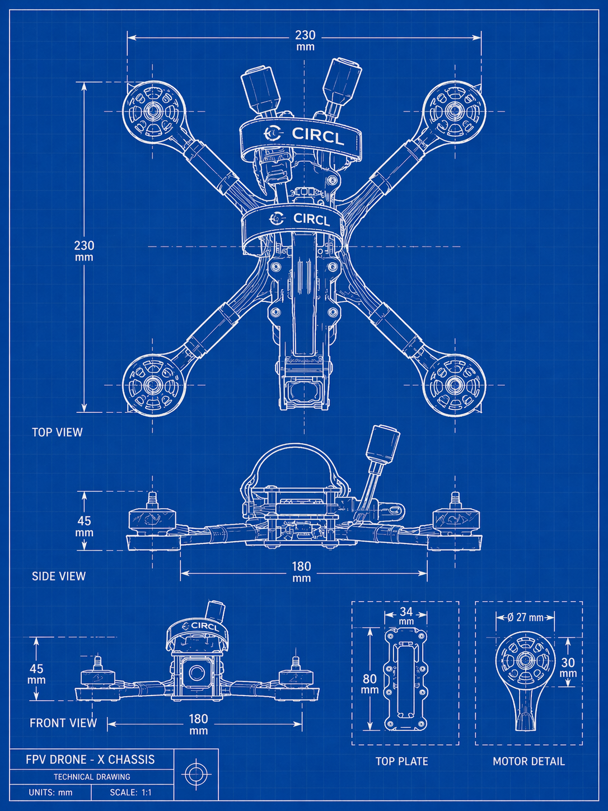

# Drone-Forensic

  

This repository is designed to accelerate the forensic analysis of DIY FPV
drones and to help automate technical reporting from seized or recovered
artifacts.

The goal is pragmatic: extract useful evidence faster, normalize outputs, and
produce data that can be reused in reports or shared into investigative
platforms such as MISP.

Related reading:

- https://www.misp-project.org/2026/03/10/have-you-ever-thought-about-drones-in-misp.html/

## Repository Overview

The repository is split into four main analysis areas:

### `fc/`

Flight controller firmware analysis for STM32-based drone controllers.

This part of the repository helps to:

- identify the flight controller family with YARA
- identify the target board and chipset
- extract configuration areas from raw dumps
- decode recovered configuration values

Currently, the tooling focuses on:

- Betaflight
- INAV
- ArduPilot (partial support)

Typical values that can be recovered include:

- craft name
- pilot name
- saved waypoints
- STM32 chip serial information for some acquisition workflows

### `blackbox/`

Blackbox log extraction and decoding for Betaflight and INAV flight blackboxes.

This part of the repository helps to:

- inspect embedded Blackbox logs inside raw dumps
- extract CSV outputs for flight data analysis
- export GPS traces as CSV and GPX
- compute hashes and structured metadata for reporting

The custom `bbox_decode.py` decoder can provide:

- quick `--info` summaries
- JSON output for automation
- per-log CSV output
- GPS-derived arming and disarming coordinates when available

### `elrs/`

ExpressLRS-oriented tooling for UID analysis and extraction of configuration
artifacts from ELRS (TX and RX) device related dumps.

This part of the repository helps to:

- derive an ELRS UID from a binding phrase
- extract `uid`, `wifi-ssid`, and `wifi-password` from raw blobs
- build or query a kvrocks-backed rainbow table for ELRS binding phrases

This is useful when investigating radio-control components and operator-side
configuration left in ELRS TX/RX artifacts.

### `misp/`

MISP integration helpers to convert parsed drone artifacts into a structured
MISP event ready for sharing or enrichment.

This part of the repository helps to:

- ingest any subset of `--fc`, `--blackbox`, and `--elrs` inputs
- generate a single MISP Event JSON (`event.json` by default)
- build related MISP objects (`uav`, `iot-firmware`, `file`, `gpx`, `geolocation`, `wifi-connection`, `remote-controller`)
- preserve evidence hashes and include attachments
- optionally push the generated event directly to a MISP instance

Main files:

- `misp/drone_to_misp.py`: extractor + event builder + optional push client
- `misp/misp_config.json.example`: template for MISP URL/API key/SSL settings

## Intended Use

This repository is intended for forensic and incident-response workflows where
time matters and repetitive extraction tasks should be automated.

Typical use cases include:

- triaging a DIY FPV drone after seizure or crash recovery
- extracting structured technical indicators from controller or radio dumps
- producing repeatable outputs for analyst notes and formal reports
- preparing data for downstream sharing and correlation

## Workshop

The `workshop/` directory contains the Drone Forensic workshop material
presented at FIRST CTI 2026.

Event summary:

- workshop title: `Drone Threat Intelligence Workshop`
- format: hands-on session combining theory and practice for drone threat
  hunting and intelligence sharing
- when: Tuesday, April 21, 2026 (duration: 4h)
- where: FIRST CTI 2026, Holiday Inn Munich City Centre, Munich, Germany

Conference reference:

- https://www.first.org/conference/firstcti26/program

## Notes

- Each subdirectory contains its own README with tool-specific usage examples.
- The tooling is built around real-world dump parsing rather than generic drone theory.
- Some targets are only partially supported and may require adaptation for exotic firmware or hardware revisions.

## FeedBack

- Please send us any exotic Firmware unsupported or where the extraction did not succeed.

## Author and License

This tooling is developed by CIRCL Luxembourg www.circl.lu.

This project is licensed under the GNU Affero General Public License v3.0
(AGPL-3.0). See the repository [`LICENSE`](./LICENSE) file for details.
